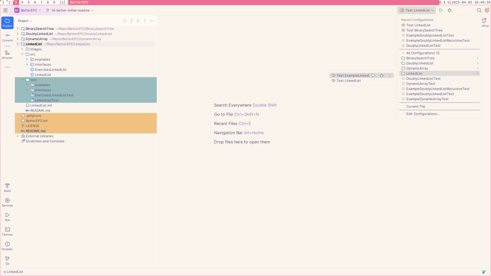
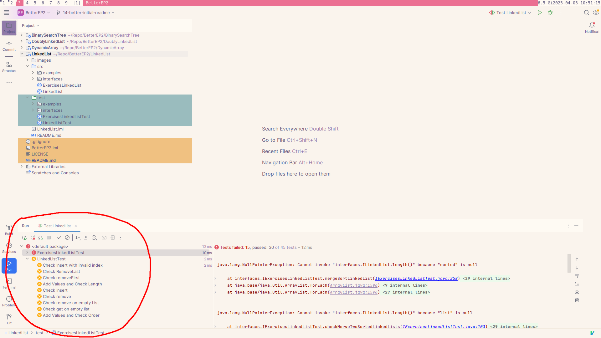
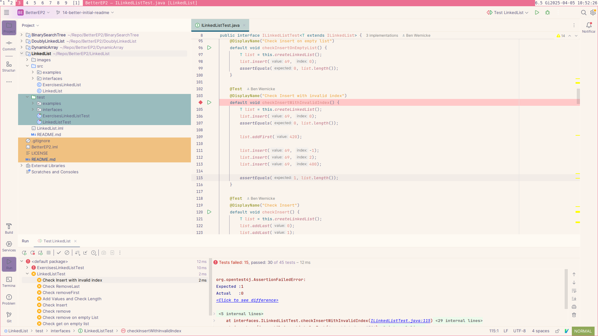
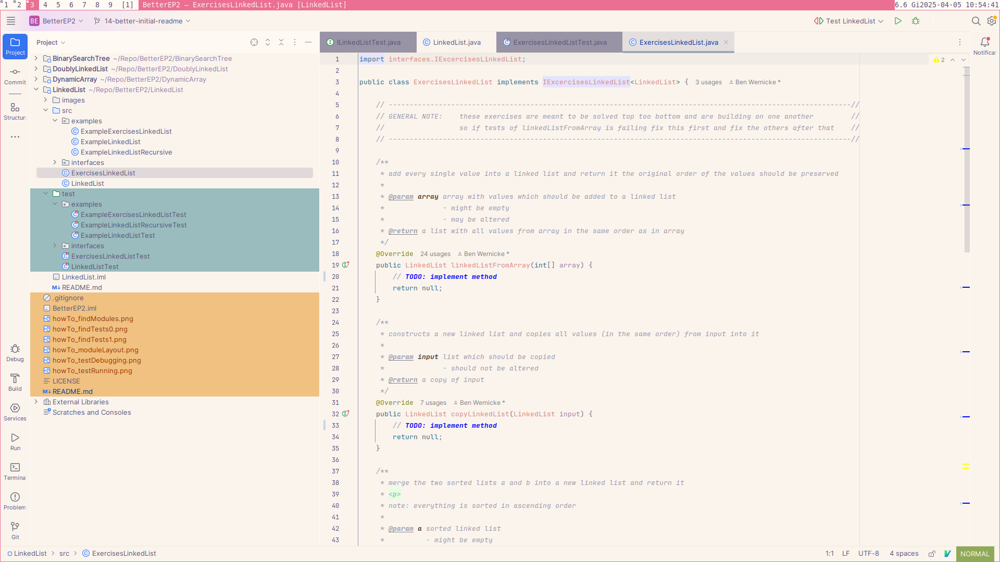

# Better EP2

[](https://github.com/AnonymeMasse/BetterEP2/actions/workflows/junit-tests.yml)

## Für wen ist dieses Repo
Dieses Repo ist gedacht, um den Step-Up zwischen den Vorlesungen EP1 und EP2
(an der TU-Wien) zu vereinfachen, indem es einem erlaubt, die einzelnen
Datenstrukturen, die in EP2 vorgestellt werden, als Standalones zu
programmieren, zu testen, zu debuggen und ein paar simple Aufgaben, um sich mit
ihrem Interface bekannt zu machen, zu lösen.

## WIP Disclaimer
Dieses Repo ist aktuell ein Work In Progress. Momentan ist nur das `LinkedList`
Modul fertig. Ihr könnt euch gerne auch die anderen Sachen anschauen,
allerdings sind diese nicht vollständig, oder könnten sich noch verändern.

Zudem sind wir uns nicht sicher, ob unsere Unit-Tests alle Edge Cases abdecken
(dies wäre unser Ziel). Falls ihr einen Edgecase findet, der nicht von den
Unit-Tests gecovert wird, bitte schreibt uns an, oder macht ein Issue auf damit
wir einen Unit-Test hinzufügen können

Natürlich sind wir auch für alle anderen Vorschläge offen, z. B.:
- neue Beispiele für eine Datenstruktur
- neue Datenstrukturen, die gewünscht sind
- Module spezifisch nur für Algorithmen und nicht nur für Datenstrukturen   

## HOW TO
### Module
Dieses Repo ist ein einzelnes IntelliJ Project, welches weiters in mehrere
Module eingeteilt ist.

Hier seht ihr die einzelnen Module in IntelliJ:


Diese Module sollte man nacheinander bearbeiten und sie sind auch nicht
voneinander abhängig. Unsere empfohlene Reihenfolge ist:
1. DynamicArray
2. LinkedList
3. DoublyLinkedList
4. BinarySearchTree

### Aufbau der Module
Jedes Modul besteht im Wesentlichen aus drei Teilen:
1. `src` Directory ... hier könnt ihr euren Code schreiben
2. `test` Directory ... hier wird euer Code (und auch die Musterlösung)
   getestet
3. eine README.md ... welche die Datenstruktur step-by-step erklärt.


Bei LinkedLists zum Beispiel würde man sich zuerst die Datei:
`LinkedList/src/LinkedList.java` anschauen und die Klasse mithilfe
`LinkedList/README.md` implementieren.

Wenn man damit fertig ist, kann man die eigene Implementation testen und
Debuggen (siehe Testen und Debuggen). Nachdem man eine funktionierende
Implementation einer LinkedList hat. Kann man sich nun den
`LinkedList/src/ExercisesLinkedList.java` widmen und diese lösen. Für diese
gibt es keine README mehr, die genau erklärt, wie etwas funktioniert.  Die
Methoden sind von oben nach unten zu implementieren und werden auch von oben
nach unten schwieriger.

> NOTE: die Methoden in den Exercises sind voneinander abhaenging. Wenn also
> die Tests fuer die erste failen, kann es sein, dass die Tests fuer die
> naechsten auch failen. Deswegen bitte von oben nach unten arbeiten!  

### Testen und Debuggen
Die Tests findet ihr oben rechts bei den anderen Run Configurations.

 

Hier gibt es unter dem `LinkedList` Modul zwei Tests. `Test LinkedList` wird
euren Code testen und `Test ExampleLinkedList` wird die Musterlösungen testen.

Nachdem ihr einen Test ausgeführt habt, könnt ihr links unten die einzelnen
failing Tests sehen.



Hier sehen wir, dass unsere aktuelle LinkedList Implementation sehr viele
Failing Tests hat (da diese noch nicht implementiert ist). Wie würde man jetzt
einen solchen Test debuggen?

Hier kann man einfach einen Doppelklick auf den Failing Test machen, den man
sich anschauen möchte, wodurch man direkt auf das `assert` kommt welches
failed. Hier kann man sich dann einfach einen Breakpoint setzen (vermutlich ist
es besser den Breakpoint ein wenig früher zu setzen als das assert) und die
Tests nochmal im Debugger starten.



### Musterlösungen
Alle Musterlösungen sind mit `Example` prefixed und sind in den example
packages zu finden, sowohl in `src` als auch in `test`



## Complex Bullshit
Wir verwenden in diesem Repo einige Konzepte, die vielleicht noch nicht ganz
klar sind. Und auch gar nicht komplett verstanden werden müssen. Hier findet
ihr ein bisschen Information, was die jeweiligen Sachen jeweils ca. sind und
wozu / warum wir sie verwenden.

### Integer
Alle Datenstrukturen arbeiten auf `int`, da dies am leichtesten ist. Einige
Methoden returnen allerdings einen `Integer`. Dies ist eine Wrapper Klasse von
Java, die man wie einen `int` behandeln kann, der allerdings auch `null` sein
darf. Dies verwenden wir für Methoden, die 'failen' können. Also zum Beispiel
eine `Integer get(int index);` Methode würde `null` returnen, wenn der `index`
invalid ist.

Bei einer Funktion, die einen `Integer` returned, kann man trotzdem einfach
`return 69;` schreiben (dies nennt man autoboxing).

### Interfaces und Generics
Wir verwenden Interfaces und Generics, damit wir die gleichen Tests für die
Musterloesungen und die Beispiele verwenden können. Ein Interface beschreibt
lediglich, was eine Klasse können, muss, die das Interface implementiert. 

Die Tests verwenden außerdem Generics. Zeilen wie:
```java
T list = this.createLinkedList();
```
Bedeuten einfach nur, dass wir eine LinkedList von dem Typen der gerade
getestet wird erstellen.

### More?
Falls noch mehr Konzepte unklar sind, bitte ein Issue aufmachen oder schreiben
damit wir diese hier auch kurz erklären können.

## Disclaimer zum Namen
Dieser Name soll lediglich zeigen, dass dieses Repo an die EP2 Vorlesung
gekoppelt ist (allerdings nicht mit ihr assoziiert, wir sind nur ein paar
Studenten die, das hier freiwillig machen) und nicht dass dieses Repo die EP2
Vorlesung ersetzen könnte.
